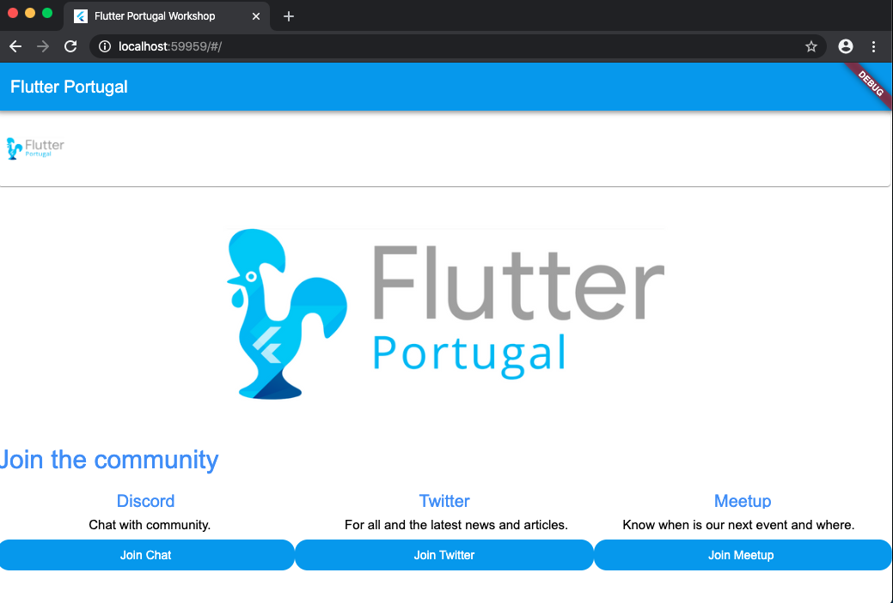

<h1 align="center">
    
</h1>

Tela estatica testando com Flutter Web

📌 Flutter Portugal Web
------------------
O projeto foi feito com Flutter com os amigos de Flutter Portugal 

🔧 Tecnologias utilizadas:
------------------

- Flutter
- Flutter Web
- Dart

💬 Fale comigo
------------------
[*Entre em contato comigo*](https://www.linkedin.com/in/ivo-baptista-3712144/)

💬 Fale com Flutter Portugal

[*Entre em contato atravez do Discord*](https://discord.gg/trEcse)

*Foi feito para testes nao esta pronto falta alinhamentos e alguns detalhes.

# flutterportugalweb

A new Flutter Web project.

## Getting Started

This project is a starting point for a Flutter application.

A few resources to get you started if this is your first Flutter project:

- [Lab: Write your first Flutter app](https://flutter.dev/docs/get-started/codelab)
- [Cookbook: Useful Flutter samples](https://flutter.dev/docs/cookbook)

For help getting started with Flutter, view our
[online documentation](https://flutter.dev/docs), which offers tutorials,
samples, guidance on mobile development, and a full API reference.
